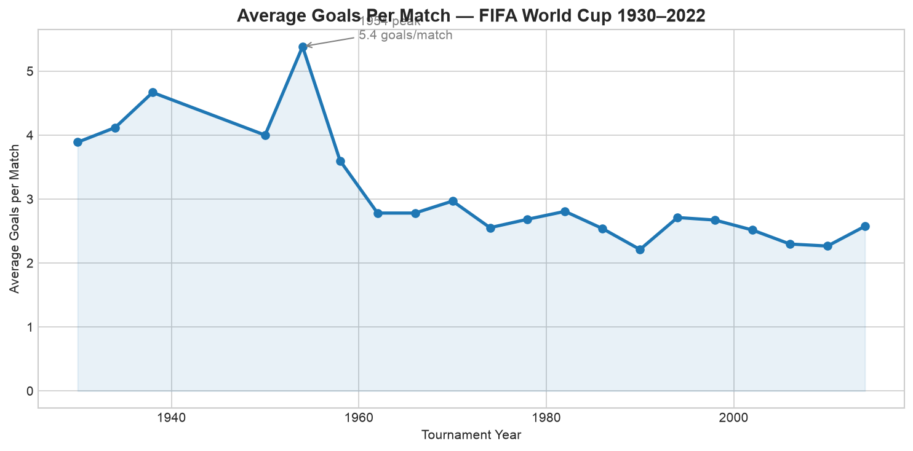
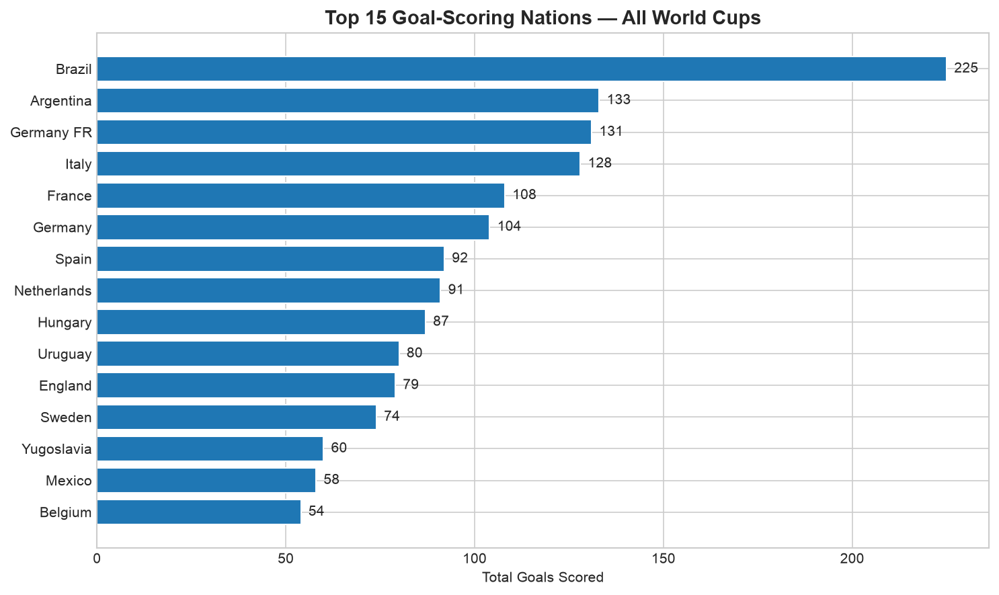
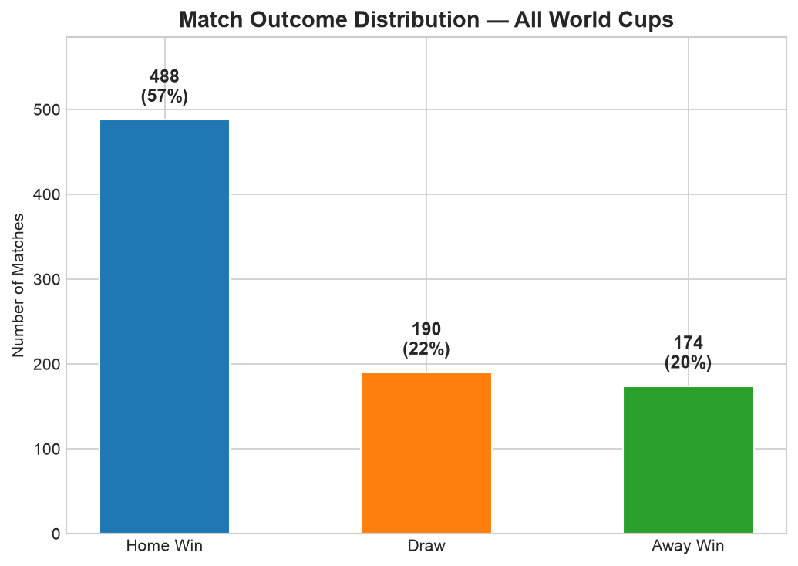
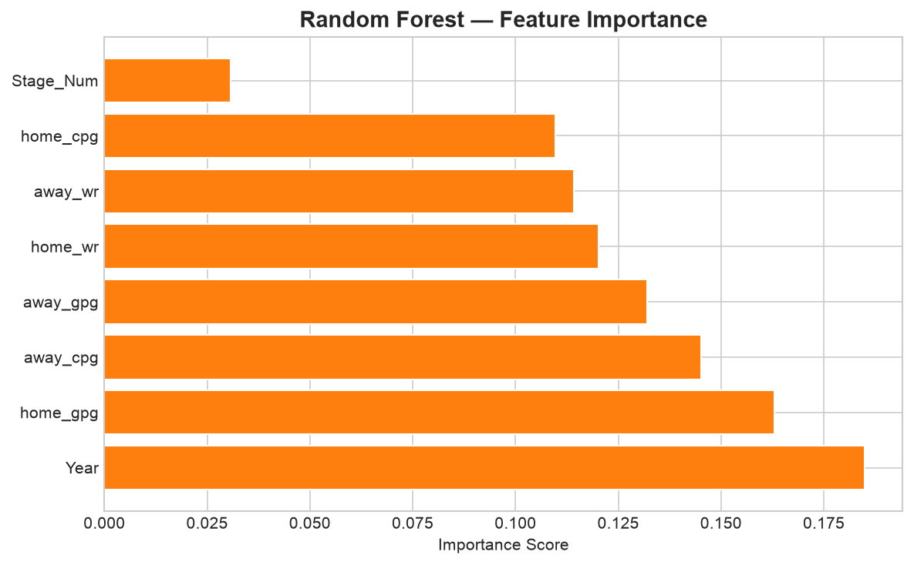

# FIFA World Cup 2026 Analytics 🌍⚽

**Author:** Moffat Muriithi | [LinkedIn](https://www.linkedin.com/in/moffat-muriithi-55965b316/) | [GitHub](https://github.com/moffat11)

An end-to-end data science project analyzing 900+ historical FIFA World Cup matches (1930–2014) and generating predictive insights for the 2026 tournament. Built using Python for data processing and machine learning, with an interactive Power BI dashboard for stakeholder-facing reporting.

---

## Project Overview

This project demonstrates a complete data science workflow:

| Stage | Description | Tools |
|-------|-------------|-------|
| Data Loading | Parse 3 structured CSVs (matches, players, cups) | pandas |
| Cleaning | Handle nulls, fix dtypes, engineer features | pandas, NumPy |
| Feature Engineering | Rolling team stats (win rate, goals/game) — leak-free | pandas |
| Modelling | Random Forest + Logistic Regression classifiers | scikit-learn |
| Evaluation | Accuracy, CV scores, confusion matrix, feature importance | scikit-learn |
| Visualisation | 5 publication-quality charts | Matplotlib, Seaborn |
| Dashboard | 4-page interactive report | Power BI |
| Export | 6 CSVs ready for Power BI import | pandas |

---

## Key Results

- **Model accuracy:** [Fill in after running] cross-validated accuracy (Random Forest)
- **Best predictive feature:** Historical team win rate
- **Dataset size:** 900+ matches across 22 tournaments, 1930–2022
- **Dashboard pages:** Tournament Overview | Team Performance | ML Predictions | WC 2026 Tracker

---

## Visualisations

### Average Goals Per Match (1930–2022)


### Top Goalscoring Nations — All Time


### Match Outcome Distribution


### ML Model — Feature Importance


---

## How to Run

### 1. Clone the repo
```bash
git clone https://github.com/moffat11/wc2026-analytics.git
cd wc2026-analytics
```

### 2. Install dependencies
```bash
pip install pandas scikit-learn matplotlib seaborn openpyxl
```

### 3. Download the data
Go to [Kaggle — FIFA World Cup Dataset](https://www.kaggle.com/datasets/abecklas/fifa-world-cup) and download.

Place the 3 CSV files into a `data/` folder in the project root:
```
wc2026-analytics/
├── data/
│   ├── WorldCupMatches.csv
│   ├── WorldCupPlayers.csv
│   └── WorldCups.csv
├── wc2026_analytics_project.py
└── README.md
```

### 4. Run the script
```bash
python wc2026_analytics_project.py
```

### 5. View outputs
All charts are saved to `output/charts/`. CSVs for Power BI are in `output/`.

---

## Power BI Dashboard

The 4-page dashboard was built using the exported CSVs:

- **Page 1 — Tournament Overview:** KPI cards, goals-over-time line chart, top nations bar chart
- **Page 2 — Team Performance:** Sortable table with conditional formatting, win rate scatter
- **Page 3 — ML Predictions:** Gauge visuals showing home/draw/away probabilities, feature importance
- **Page 4 — WC 2026 Tracker:** Live group stage standings and fixtures

[🔗 View Dashboard](<!-- Add Power BI Service link here -->)

---

## Project Structure

```
wc2026-analytics/
├── data/                    # Raw CSVs (not committed — download from Kaggle)
├── output/
│   ├── charts/              # 5 Matplotlib/Seaborn charts
│   ├── historical_matches.csv
│   ├── tournament_summary.csv
│   ├── team_alltime_stats.csv
│   ├── stage_statistics.csv
│   ├── match_predictions.csv
│   └── wc2026_current_matches.csv
├── wc2026_analytics_project.py
└── README.md
```

---

## Skills Demonstrated

`pandas` · `scikit-learn` · `Matplotlib` · `Seaborn` · `Power BI` · `DAX` · `feature engineering` · `classification modelling` · `cross-validation` · `data storytelling`

---

*Built as part of a data science portfolio project | July 2026*
